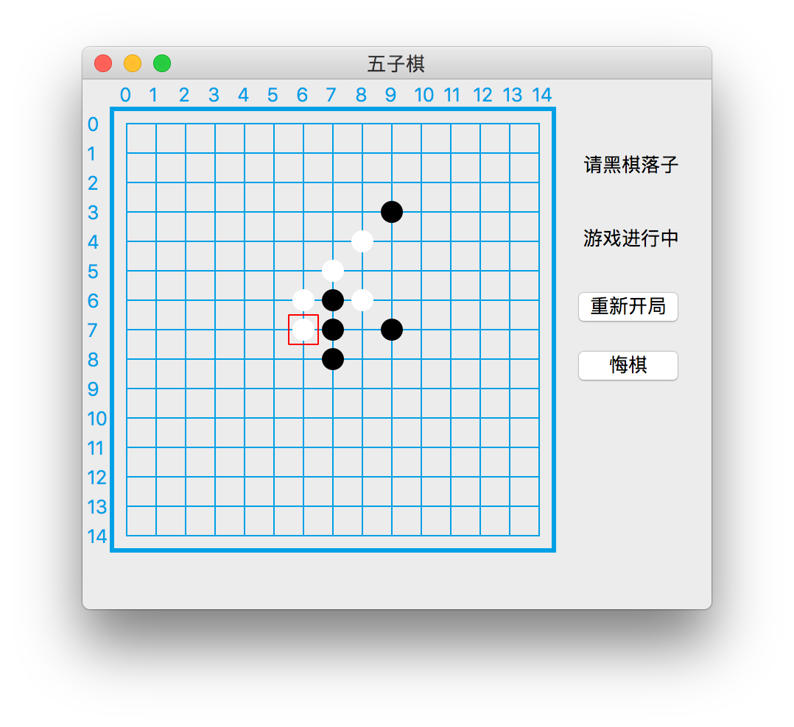

# Gomoku2

简单五子棋AI,使用Qt构建界面,可轻松打赢不怎么下五子棋的人

使用:

●博弈树

●Alpha-Beta剪枝(性能提高较大)

●启发式搜索(性能提高较大)

●落子区域限制(性能提高较大)

●Zobrist哈希(性能小幅提升)

●Qt多线程计算避免界面卡死

●小概率走法剔除

仅进行Alpha-Beta剪枝+落子区域限制,思考两层,计算量在3k-9k,2s内计算完毕;思考四层,计算量在9k-20w,2s~20min内计算完毕.

+启发式搜索,思考两层,思考两层,计算量在900-2k,1s内计算完毕;思考四层,计算量在3k-3w,2s~20s内计算完毕.

+小概率走法剔除,思考两层,思考两层,计算量在24-60,1s内计算完毕;思考5层,计算量在2k-3k,1s内计算完毕;思考7层,计算量在8k-3w,2min~10min内计算完毕
